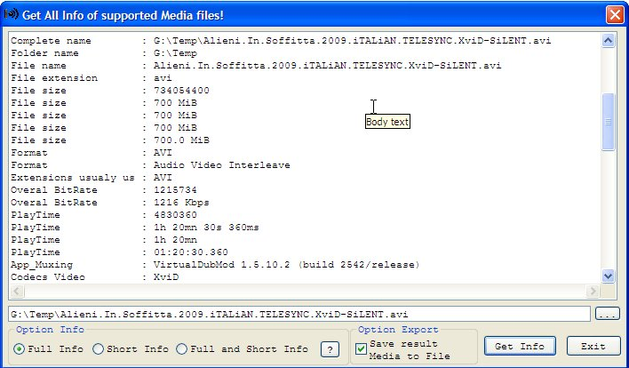



## How to get all Media Info using the MediaInfo library \[Update missing module\]

### Description

Well, this project demonstrates how is possible in VB5/6 to interface with the library 'MediaInfo.dll' and retrive all information about media video and media music files!

Supported formats:

MediaInfoLib - v0.6.1.1 - http://mediainfo.sourceforge.net

----

Known Format:

Matroska (mkv/mka/mks) -&gt; NOT SURE!!!

Ogg (ogg/ogm)

Riff (avi/wav)

Mpeg 1&amp;2 container (mpeg/mpg/vob)

Mpeg 4 container (mp4)

Mpeg video specific (mpgv/mpv/m1v/m2v)

Mpeg audio specific (mp2/mp3)

Windows Media (asf/wma/wmv)

Quicktime (qt/mov)

Real (rm/rmvb/ra)

DVD-Video (ifo)

AC3 (ac3)

DTS (dts)

AAC (aac)

Monkey Audio (ape/mac)

Flac (flac)

CDXA, like Video-CD (dat)

Apple/SGI (aiff/aifc)

Sun/NeXT (au)

Amiga IFF/SVX8/SV16 (iff)

Ensoniq PARIS (paf)

Sound Designer 2 (sd2)

Berkeley/IRCAM/CARL (irca)

SoundFoundry WAVE 64 (w64)

Matlab (mat)

Portable Voice format (pvf)

FastTracker2 Extanded (xi)

Midi Sample dump Format (sds)

Audio Visual Research (avr)

Happy coding VB...

Support italian Software ;)

tnx...
 
### More Info
 

             |
---                |---
**Submitted On**   |2009-08-19 23:25:42
**By**             |[Salvo Cortesiano \(Italy\)](https://github.com/Planet-Source-Code/PSCIndex/blob/master/ByAuthor/salvo-cortesiano-italy.md)
**Level**          |Advanced
**User Rating**    |5.0 (10 globes from 2 users)
**Compatibility**  |VB 5\.0, VB 6\.0
**Category**       |[Coding Standards](https://github.com/Planet-Source-Code/PSCIndex/blob/master/ByCategory/coding-standards__1-43.md)
**World**          |[Visual Basic](https://github.com/Planet-Source-Code/PSCIndex/blob/master/ByWorld/visual-basic.md)
**Archive File**   |[How\_to\_get2160398202009\.zip](https://github.com/Planet-Source-Code/salvo-cortesiano-italy-how-to-get-all-media-info-using-the-mediainfo-library-update-missin__1-72378/archive/master.zip)

